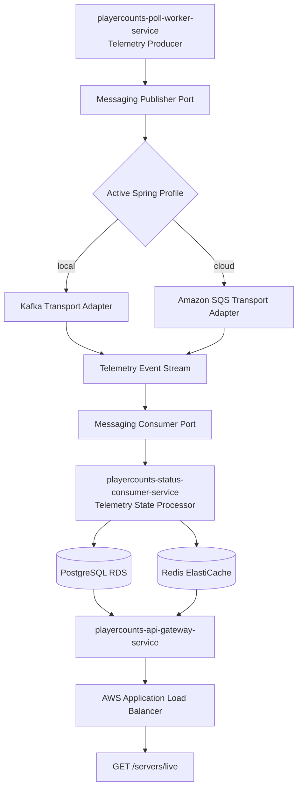

# PlayerCounts Platform

Distributed event-driven telemetry backend for continuously monitoring live multiplayer server population data at cloud scale.

This platform performs real server telemetry collection, asynchronous event streaming, live telemetry processing, and public API exposure through a fully containerized AWS deployment.

---

## Overview

PlayerCounts Platform is a production-focused backend system built to ingest, process, store, and serve live player count telemetry across online multiplayer game networks.

The current implementation supports Minecraft, with the underlying platform designed for future expansion into additional game ecosystems.

Every polling cycle:

- real Minecraft servers are pinged using MCProtocolLib
- telemetry events are emitted into an asynchronous messaging layer
- consumer workers persist the latest state into PostgreSQL and Redis
- a public API serves aggregated live results behind an AWS load balancer

The project was intentionally built as a distributed cloud-native microservice platform rather than a single monolith in order to demonstrate:

- event-driven architecture
- asynchronous workload decoupling
- relational + in-memory persistence design
- Dockerized service deployment
- Infrastructure as Code
- AWS ECS/Fargate production hosting

---

## Local Development

Two local development workflows are supported:

### Hybrid IDE Mode (Recommended)

Start only the infrastructure dependencies:

```bash
docker compose up kafka zookeeper redis postgres
```

Then run the three Spring Boot services from your IDE using the `local` profile.

### Full Container Mode

Run the entire stack in Docker:

```bash
docker compose up --build
```

This starts both infrastructure dependencies and all PlayerCounts application services.

### Infrastructure Dependencies

- Zookeeper
- Kafka Broker
- Redis
- PostgreSQL

### PlayerCounts Application Services

- **Telemetry Producer** (`playercounts-poll-worker-service`)
- **Telemetry State Processor** (`playercounts-status-consumer-service`)
- **Public API Gateway** (`playercounts-api-gateway-service`)

### Local API

```text
http://localhost:8080/servers/live
```

---

## Live Distributed Architecture




---

## Core Services

### `playercounts-poll-worker-service`

Responsible for:

- continuously pinging configured Minecraft networks
- collecting live online player counts, max player caps, and latency
- publishing telemetry events into the cloud messaging layer

Uses:

- Spring Boot scheduled worker execution
- MCProtocolLib real status pinging
- transport abstraction for event publishing

---

### `playercounts-status-consumer-service`

Responsible for:

- consuming asynchronous telemetry events from the queue
- materializing latest server state
- writing durable records to PostgreSQL
- writing hot read values to Redis

Uses:

- Spring Boot worker runtime
- SQS long-poll consumer loop
- JPA persistence
- Redis template writes

---

### `playercounts-api-gateway-service`

Responsible for:

- exposing public REST endpoints
- reading live server snapshots
- serving client-facing JSON responses

Current primary endpoint:

```http
GET /servers/live
```

---

## Example Live Response

```json
[
  {
    "serverAddress": "hypixel.net",
    "onlinePlayers": 28155,
    "maxPlayers": 200000,
    "latencyMs": 91,
    "online": true,
    "timestamp": 1777728449275
  },
  {
    "serverAddress": "cubecraft.net",
    "onlinePlayers": 1274,
    "maxPlayers": 5000,
    "latencyMs": 35,
    "online": true,
    "timestamp": 1777728314218
  }
]
```

---

## Technology Stack

### Backend

- Java 21
- Spring Boot 3
- Maven multi-module monorepo
- Spring Data JPA
- Spring Data Redis

### Messaging / Eventing

- Kafka transport adapter for local development
- Amazon SQS transport adapter for cloud deployment
- pluggable publisher / consumer abstractions

### Minecraft Telemetry

- [MCProtocolLib](https://github.com/GeyserMC/MCProtocolLib)
- real status ping protocol integration

### Persistence

- PostgreSQL (Amazon RDS)
- Redis (Amazon ElastiCache)

### Cloud / Infrastructure

- Docker
- AWS ECS Fargate
- AWS ECR
- AWS SQS
- AWS Application Load Balancer
- AWS CloudWatch
- Terraform

---

## AWS Deployment

The platform is fully deployed to AWS using Infrastructure as Code.

Provisioned resources include:

- ECS Fargate cluster
- 3 containerized microservices
- ECR image repositories
- SQS telemetry queue
- PostgreSQL RDS instance
- Redis ElastiCache cluster
- Application Load Balancer
- VPC, subnets, security groups, IAM roles, CloudWatch logs

All infrastructure is provisioned reproducibly via Terraform under:

```text
infra/terraform
```

---

## Cloud Deployment Workflow

1. Provision AWS infrastructure via Terraform
2. Build service Docker images
3. Push images to Amazon ECR
4. Launch ECS Fargate services
5. Verify telemetry flow via CloudWatch and ALB endpoint

---

## Future Roadmap

Planned next expansions:

- historical time-series player count storage
- trend analytics endpoints
- CI/CD pipeline automation
- frontend visualization dashboard
- autoscaling worker configuration
- monitoring and alerting improvements

---

## Platform Vision

PlayerCounts Platform is a distributed telemetry backend being built under [LunarWorlds](https://lunarsworld.com/) to provide live player population monitoring and public telemetry services for online multiplayer games.

The current release targets Minecraft server telemetry, with the broader platform designed for future multi-game expansion.